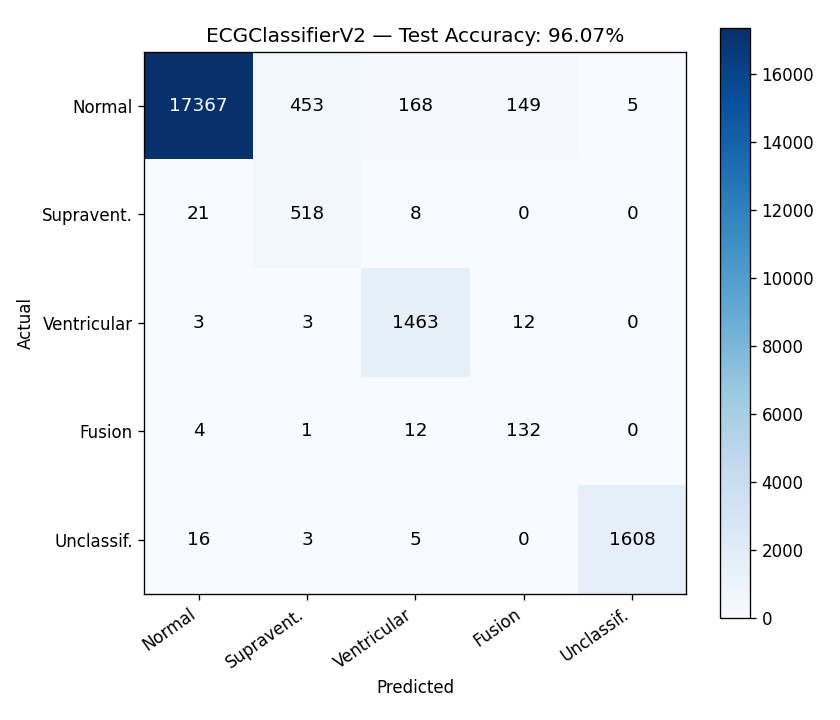

# ECG Arrhythmia Classifier


Real-time 1-D CNN arrhythmia classification deployed on two independent
embedded targets — an **STM32F446RE** (Cortex-M4, 180 MHz) via ST X-CUBE-AI, and a
**Nexys A7-100T FPGA** via a hand-written SystemVerilog inference pipeline —
both trained on the **MIT-BIH Arrhythmia Database**.

---

## Table of Contents

1. [System Overview](#system-overview)
2. [Hardware](#hardware)
3. [Signal Chain — STM32 Path](#signal-chain--stm32-path)
4. [Signal Chain — FPGA Path](#signal-chain--fpga-path)
5. [Model Architecture](#model-architecture)
6. [INT8 Quantization](#int8-quantization)
7. [FPGA CNN Pipeline](#fpga-cnn-pipeline)
8. [Repository Layout](#repository-layout)
9. [Build & Flash — STM32](#build--flash--stm32)
10. [Build & Program — FPGA](#build--program--fpga)
11. [Training](#training)
12. [Results](#results)
13. [Dataset](#dataset)

---

## System Overview

Two fully independent inference paths read an ECG signal, detect R-peaks,
extract a 360-sample beat window, and classify it into one of five AAMI beat
categories in real time.

```
                        ┌─────────────────────────────────────────────────┐
                        │             ECG SENSOR FRONT-END                │
                        │                                                 │
                        │   Patient ──► AD8232 ──► STM32 ADC1 (PA0)      │
                        │                                                 │
                        │   Patient ──► Pmod AD1 ──► FPGA Pmod JA        │
                        │              (AD7476A, SPI)                     │
                        └───────────────┬─────────────────┬───────────────┘
                                        │                 │
                           ─────────────▼──────           ▼──────────────────
                          │  STM32F446RE (Nucleo) │    │  Nexys A7-100T FPGA │
                          │  180 MHz Cortex-M4    │    │  Artix-7 XC7A100T  │
                          │                       │    │  100 MHz            │
                          │  Pan-Tompkins R-peak  │    │  FIR filter         │
                          │  ADC @ 360 Hz, 12-bit │    │  R-peak detector    │
                          │  Z-score normalise    │    │  Beat buffer (BRAM) │
                          │  X-CUBE-AI Float32    │    │  INT8 CNN pipeline  │
                          │  UART result @ 115200 │    │  VGA 640×480 live   │
                           ──────────────────────     │  LED one-hot class  │
                                                       ─────────────────────
                                                       
        Classes:  N — Normal     S — Supraventricular     V — Ventricular
                  F — Fusion     Q — Unclassifiable
```

---

## Hardware

| Component | Part | Role |
|---|---|---|
| MCU | STM32F446RE (Nucleo-64) | X-CUBE-AI Float32 inference |
| FPGA | Nexys A7-100T (XC7A100T) | INT8 CNN inference + VGA display |
| ECG front-end (MCU) | AD8232 module | Analog signal conditioning |
| ADC (FPGA) | Pmod AD1 (AD7476A, 12-bit SPI) | Digitiser on Pmod JA |
| Display | VGA monitor | 640×480 live ECG + classification |
| Debug | ST-Link v2 / UART 115200 | Flashing + serial output |

### Nexys A7 Pin Assignments (top.xdc)

```
Clock / Reset
  clk        E3      100 MHz on-board oscillator
  cpu_resetn C12     Active-low reset pushbutton (BTNC)

Pmod AD1 — Pmod JA (AD7476A SPI ADC)
  ad1_miso   C17     JA1   MISO (SDO from ADC)
  ad1_sck    E18     JA3   SCLK
  ad1_csn    G17     JA4   /CS

VGA
  vga_hs     P19     Horizontal sync
  vga_vs     R19     Vertical sync
  vga_r[3:0] N19,J19,H19,G19
  vga_g[3:0] J17,H17,G17,D17
  vga_b[3:0] N18,L18,K18,J18

LEDs
  led[4:0]   H17,K15,J13,N14,R18   One-hot class  (N S V F Q)
  led[7]     T14                    Beat indicator (toggles on each R-peak)
```

---

## Signal Chain — STM32 Path

```
AD8232 analogue output
        │
        ▼ PA0 / ADC1 Channel 0
┌───────────────────────────────────────────────────────────┐
│  TIM2 interrupt  @  360 Hz                               │
│  (APB1=45 MHz × 2, Prescaler=249, Period=999)            │
│                                                           │
│  1. HAL_ADC_GetValue() → 12-bit sample → /4095 → float   │
│                                                           │
│  2. Pan-Tompkins R-peak detector                         │
│     ┌────────────────────────────────────────────────┐   │
│     │ Derivative filter: y = (2x[n]+x[n-1]          │   │
│     │                        -x[n-3]-2x[n-4]) / 8   │   │
│     │ Square:  sq = y²                               │   │
│     │ 30-sample moving-window integration (MWI)      │   │
│     │ Adaptive threshold = 0.5 × running peak        │   │
│     │ 200 ms refractory period (72 samples @ 360 Hz) │   │
│     └────────────────────────────────────────────────┘   │
│                                                           │
│  3. On R-peak:  extract circular-buffer window           │
│     start = r_peak_pos − 180   (±180 samples, 0.5 s)    │
│     ecg_buffer[360] ← circ_buf[start : start+360]       │
│                                                           │
│  4. Z-score normalise per beat                           │
│     mean = Σecg_buffer / 360                             │
│     std  = √(Σ(x−mean)² / 360)                          │
│     ecg_buffer[i] = (ecg_buffer[i] − mean) / std        │
│                                                           │
│  5. beat_ready = 1  →  main loop calls                   │
│     MX_X_CUBE_AI_Process()                               │
└───────────────────────────────────────────────────────────┘
        │
        ▼ float32[1×360×1]  →  X-CUBE-AI runtime
┌───────────────────────────────────────────────────────────┐
│  ECGClassifierV2  (network.c / network_data_params.c)    │
│  5,728,613 MACCs  ·  460.52 KiB weights  ·  27 KiB RAM  │
│  → class_scores[5]  →  argmax  →  UART2 @ 115200        │
└───────────────────────────────────────────────────────────┘
```

---

## Signal Chain — FPGA Path

```
Pmod AD1 (AD7476A, 12-bit)
        │ SPI: SCLK=E18, CS=G17, MISO=C17
        ▼
┌─────────────────────────────────────────────────────────────────┐
│  spi_master                                                     │
│  Generates SCLK by dividing 100 MHz, clocks 12 bits out of     │
│  AD7476A on each /CS assertion.                                 │
│  Outputs: sample[11:0], sample_valid (one pulse per conversion) │
└──────────────────┬──────────────────────────────────────────────┘
                   │ sample[11:0] + valid
                   ▼
┌──────────────────────────────────────────────────────────────────┐
│  fir_filter                                                      │
│  Fixed-coefficient low-pass FIR (removes high-frequency noise). │
│  Passes filtered sample[11:0] + valid downstream.               │
└────────────┬─────────────────────────────────────────────────────┘
             │ fir_out[11:0] + fir_valid
             ├────────────────────────────────────────────────────────┐
             │                                                        │
             ▼                                                        ▼
┌────────────────────────┐                            ┌──────────────────────┐
│  rpeak_detector        │                            │  vga_controller      │
│  Simplified derivative │                            │  640×480 @ 60 Hz     │
│  + threshold detect.   │  rpeak pulse               │  Scrolling ECG trace │
│  Output: rpeak (1 clk) ├──────────────┐             │  + class label text  │
└────────────────────────┘              │             └──────────────────────┘
                                        │
             ┌──────────────────────────┘
             ▼
┌──────────────────────────────────────────────────────────────────┐
│  beat_buffer                                                     │
│  512-deep circular BRAM.  On rpeak, waits 180 more samples,     │
│  then asserts beat_ready for one cycle.                          │
│  rd_addr/rd_data: synchronous read port exposed to adapter.      │
└──────────────────┬───────────────────────────────────────────────┘
                   │ beat_ready + rd_addr[8:0] / rd_data[11:0]
                   ▼
┌──────────────────────────────────────────────────────────────────┐
│  Beat adapter (top.sv)                                           │
│  State machine walks rd_addr 0→359.                              │
│  Converts 12-bit unsigned → INT8 signed:                        │
│    s_data = rd_data[11:4] XOR 8'h80  (MSB flip)                 │
│  Streams 360 bytes into cnn_inference via AXI-S handshake.      │
└──────────────────┬───────────────────────────────────────────────┘
                   │ s_valid / s_ready / s_data[7:0]
                   ▼
┌──────────────────────────────────────────────────────────────────┐
│  cnn_inference                                                   │
│  Pipelined INT8 1-D CNN: Conv1→Conv2→Conv3→Pool→FC1→FC2         │
│  Weights loaded at synthesis from $readmemh .mem files.          │
│  Outputs: result_valid + class_idx[2:0]                          │
└──────────────────┬───────────────────────────────────────────────┘
                   │
             ┌─────┴────────────────┐
             ▼                      ▼
      vga_controller           LED[4:0] one-hot
      (class label)            LED[7]   beat toggle
```

---

## Model Architecture

```
Input: 360-sample Z-score normalised ECG beat  (1 × 360 × 1)
             │
             ▼
┌────────────────────────────────────────────────────┐
│  Conv1d(1→32, k=5, pad=2)  + ReLU                 │
│  Output: 32 × 360                                  │
│  Params: 32×(1×5+1) = 192                          │
└────────────────────┬───────────────────────────────┘
                     │
                     ▼  MaxPool1d(2)
                 32 × 180
                     │
                     ▼
┌────────────────────────────────────────────────────┐
│  Conv1d(32→64, k=5, pad=2)  + ReLU                │
│  Output: 64 × 180                                  │
│  Params: 64×(32×5+1) = 10 304                      │
└────────────────────┬───────────────────────────────┘
                     │
                     ▼  MaxPool1d(2)
                 64 × 90
                     │
                     ▼
┌────────────────────────────────────────────────────┐
│  Conv1d(64→128, k=5, pad=2)  + ReLU               │
│  Output: 128 × 90                                  │
│  Params: 128×(64×5+1) = 41 088                     │
└────────────────────┬───────────────────────────────┘
                     │
                     ▼  MaxPool1d(2)
                128 × 45
                     │
                     ▼  AvgPool1d(kernel=11, stride=11)
                128 × 4   →  Flatten  →  512
                     │
                     ▼
┌────────────────────────────────────────────────────┐
│  Linear(512 → 128)  + ReLU  + Dropout(0.5)        │
│  Params: 512×128+128 = 65 664                       │
└────────────────────┬───────────────────────────────┘
                     │
                     ▼
┌────────────────────────────────────────────────────┐
│  Linear(128 → 5)  — raw logits                    │
│  Params: 128×5+5 = 645                             │
└────────────────────┬───────────────────────────────┘
                     │
                     ▼  argmax
            class ∈ { N, S, V, F, Q }

Total parameters : 117 893
Total MACCs      : 5 728 613
Weights (float32): 460.52 KiB
Activations RAM  : 27.00 KiB  (STM32 target)
```

### Output Classes (AAMI Standard)

| idx | Label | Description |
|-----|-------|-------------|
| 0 | **N** | Normal beat |
| 1 | **S** | Supraventricular ectopic beat |
| 2 | **V** | Ventricular ectopic beat |
| 3 | **F** | Fusion of ventricular and normal beat |
| 4 | **Q** | Unclassifiable beat |

---

## INT8 Quantization

`quantization/quantize_weights.py` applies symmetric per-tensor INT8
quantization (no calibration data required) and exports two artefact sets.

```
Float32 weight tensor  W
        │
        │  peak  = max(|W|)
        │  scale = peak / 127
        │  W_q   = clip(round(W / scale), −128, 127)
        ▼
 INT8 weight tensor  W_q
        │
        ├──► <layer>_weight.mem  (hex, one byte per line, for $readmemh)
        ├──► <layer>_weight_int8.npy  (numpy archive)
        └──► cnn_params_pkg.sv  (per-layer right-shift localparam)
```

### Per-Layer Quantization Parameters

```
Layer    W shape            W peak    W scale       Acc shift
────────────────────────────────────────────────────────────
conv1    (32,  1,  5)       0.5957    4.690e-03     10
conv2    (64, 32,  5)       3.6139    2.846e-02     15
conv3    (128, 64, 5)       2.5264    1.989e-02     16
fc1      (128, 512)         2.4857    1.957e-02     16
fc2      (5,  128)          1.9572    1.541e-02     14
```

The **acc shift** is the conservative right-shift applied to the INT32
accumulator after each multiply-accumulate to bring the result back to INT8:

```
shift = ⌈log₂(127 × n_inputs)⌉
```

This guarantees no overflow regardless of weight or activation values.

### Accuracy After Quantization

```
  Float32 baseline  :  98.14 %
  INT8 (dequantized):  98.17 %   ← +0.03 % (within statistical noise)
  Accuracy drop     :  −0.03 %   (effectively zero)
```

---

## FPGA CNN Pipeline

Each layer communicates via AXI-Stream handshake (`s_valid`/`s_ready`/`s_data`).
Weights live in BRAM initialised from `.mem` files at synthesis time.

```
360 × INT8 samples  (one per clock when s_ready=1)
          │
          ▼
  ┌───────────────────┐
  │   conv1_layer     │  32 filters, k=5, pad=2
  │   IN : 1 × INT8   │  Accumulator: INT32
  │   OUT: 32 × INT8  │  Right-shift: >> CONV1_SHIFT (10)
  │   ReLU inline     │  BRAM: 160 B weights + 32 B bias
  └────────┬──────────┘
           │ 32 channels, valid+last
           ▼
  ┌───────────────────┐
  │   conv2_layer     │  64 filters, k=5, pad=2
  │   IN : 32 × INT8  │  BRAM: 10 240 B weights + 64 B bias
  │   OUT: 64 × INT8  │  Right-shift: >> CONV2_SHIFT (15)
  └────────┬──────────┘
           │ 64 channels
           ▼
  ┌───────────────────┐
  │   conv3_layer     │  128 filters, k=5, pad=2
  │   IN : 64 × INT8  │  BRAM: 40 960 B weights + 128 B bias
  │   OUT: 128 × INT8 │  Right-shift: >> CONV3_SHIFT (16)
  └────────┬──────────┘
           │ 128 channels
           ▼
  ┌───────────────────┐
  │   pool_layer      │  MaxPool × 2 → AvgPool(11,11)
  │   IN : 128 × INT8 │  45 → 4 time-steps per channel
  │   OUT: 1 × INT8   │  Streams flat bytes to FC1
  │   (serialised)    │
  └────────┬──────────┘
           │ 512 bytes, serialised
           ▼
  ┌───────────────────┐
  │   fc1_layer       │  Linear 512→128 + ReLU
  │   IN : 512 INT8   │  BRAM: 65 536 B weights + 128 B bias
  │   OUT: 128 INT8   │  Right-shift: >> FC1_SHIFT (16)
  │   (single cycle)  │
  └────────┬──────────┘
           │ 128-wide vector, one clock
           ▼
  ┌───────────────────┐
  │   fc2_layer       │  Linear 128→5
  │   IN : 128 INT8   │  BRAM: 640 B weights + 5 B bias
  │   OUT: 5 INT8     │  Right-shift: >> FC2_SHIFT (14)
  │   (single cycle)  │
  └────────┬──────────┘
           │ 5 signed logits
           ▼
  ┌───────────────────┐
  │   argmax          │  Priority-encoded comparator tree (cnn_inference.sv)
  │   5 INT8 → idx    │  Registered output (1 clock latency)
  └────────┬──────────┘
           │ class_idx[2:0] + result_valid
           ▼
    VGA label + LED one-hot
```

---

## Repository Layout

```
ecg-arrhythmia-classifier/
│
├── fpga/                        ← SystemVerilog source (Nexys A7 / Vivado)
│   ├── top.sv                   Top-level: ADC → FIR → R-peak → CNN → VGA/LED
│   ├── cnn_inference.sv         AXI-S pipelined CNN top
│   ├── cnn_params_pkg.sv        Per-layer shift + BRAM depth parameters
│   ├── conv1_layer.sv           Conv1D, k=5, 1→32 ch, INT8
│   ├── conv2_layer.sv           Conv1D, k=5, 32→64 ch, INT8
│   ├── conv3_layer.sv           Conv1D, k=5, 64→128 ch, INT8
│   ├── pool_layer.sv            MaxPool×2 + AvgPool(11,11), serialiser
│   ├── fc1_layer.sv             Linear 512→128, ReLU, INT8
│   ├── fc2_layer.sv             Linear 128→5, INT8
│   ├── beat_buffer.sv           512-deep circular BRAM, R-peak triggered
│   ├── fir_filter.sv            Fixed-coefficient low-pass FIR
│   ├── rpeak_detector.sv        Derivative-threshold R-peak detector
│   ├── vga_controller.sv        640×480 live ECG + class label rendering
│   └── top.xdc                  Nexys A7-100T pin constraints
│
├── ecg_classifier/              ← STM32CubeIDE project (STM32F446RE)
│   ├── Core/Src/main.c          Pan-Tompkins + beat extraction + AI loop
│   ├── Core/Inc/                Headers
│   ├── X-CUBE-AI/App/           ST Edge AI generated: network.c, app_x-cube-ai.c
│   ├── Drivers/                 STM32F4xx HAL + CMSIS
│   ├── Middlewares/ST/AI/       X-CUBE-AI runtime headers
│   ├── ecg_classifier.ioc       STM32CubeMX peripheral config
│   └── fpga/ecg_fpga/           Vivado project (ecg_fpga.xpr + srcs)
│
├── model/
│   ├── ecg_model_v2.onnx        ONNX export — used by X-CUBE-AI codegen
│   └── ecg_model_v2.pth         PyTorch checkpoint
│
├── notebooks/
│   └── 01_explore_data.ipynb    MIT-BIH exploration, training, evaluation
│
├── quantization/
│   └── quantize_weights.py      Float32→INT8, writes .mem + cnn_params_pkg.sv
│
├── results/
│   ├── confusion_matrix.png     Per-class confusion matrix (test split)
│   └── weights_int8/            $readmemh .mem files + report.txt
│
└── data/                        ← gitignored (download below)
    ├── 100.dat / 100.hea / ...  MIT-BIH waveform records
    └── all_beats.npy            Pre-extracted beat matrix (316 MB)
```

---

## Build & Flash — STM32

### Requirements
- STM32CubeIDE ≥ 1.14
- ST X-CUBE-AI ≥ 9.0 (installed via CubeMX Extension Manager)
- Nucleo-F446RE board

### Steps

```
1.  Open STM32CubeIDE  →  File → Import → Existing Projects into Workspace
    Point to:  ecg_classifier/

2.  (Optional) Regenerate X-CUBE-AI network files:
    Open ecg_classifier.ioc  →  X-CUBE-AI  →  Load model/ecg_model_v2.onnx
    →  Analyse  →  Generate Code

3.  Build:  Project → Build Project   (Release or Debug)

4.  Flash:  Run → Debug   (ST-Link on-board)
            or:  Run → Run As → STM32 C/C++ Application

5.  Monitor (optional):
    Serial terminal — COM port, 115200 8N1
    Classification result printed after each detected beat.
```

### MCU Configuration Summary

| Peripheral | Setting |
|---|---|
| System clock | HSI → PLL (M=8, N=180, P=2) = **180 MHz** |
| TIM2 | Prescaler=249, Period=999 → **360 Hz** interrupt |
| ADC1 | 12-bit, Channel 0 (PA0), single conversion per interrupt |
| USART2 | 115200 baud, 8N1, TX/RX |
| GPIO LD2 | PA5, push-pull output |

---

## Build & Program — FPGA

### Requirements
- Vivado ≥ 2024.1 (free WebPACK supports Artix-7)
- Nexys A7-100T board
- Pmod AD1 connected to Pmod JA
- VGA monitor

### Steps

```
1.  Open Vivado → File → Open Project
    Point to:  ecg_classifier/fpga/ecg_fpga/ecg_fpga.xpr

2.  Add quantised weight .mem files (if not already added):
    The Vivado project sources include:  results/weights_int8/*.mem
    and  results/weights_int8/cnn_params_pkg.sv
    These are referenced by $readmemh in each layer module.

3.  Synthesise + Implement:
    Flow Navigator → Generate Bitstream  (or run all steps)

4.  Program device:
    Flow Navigator → Open Hardware Manager → Program Device
    Bitstream:  ecg_fpga.runs/impl_1/top.bit

5.  Connect hardware:
    - Pmod AD1 → Pmod JA  (pins C17 / E18 / G17)
    - VGA cable to monitor
    - AD8232 output (or signal generator) to Pmod AD1 IN

6.  Operation:
    - Green LED (LD7) toggles on each detected R-peak
    - LD4:LD0 show one-hot classification:  N=LD0  S=LD1  V=LD2  F=LD3  Q=LD4
    - VGA screen scrolls live filtered ECG with class label in top-left corner
```

### Regenerating INT8 Weight Files

If you retrain the model, regenerate `.mem` files:

```bash
cd C:/Intel/ecg-arrhythmia-classifier
pip install torch numpy scikit-learn
python quantization/quantize_weights.py
```

Then re-run Vivado synthesis so `$readmemh` picks up the new files.

---

## Training

The notebook `notebooks/01_explore_data.ipynb` covers:

- MIT-BIH record loading with `wfdb`
- Beat segmentation: ±180 samples around each annotation
- Z-score normalisation per beat
- AAMI label remapping (15 original MIT-BIH classes → 5 AAMI)
- Model training (PyTorch, Adam, cross-entropy, 50 epochs)
- Export to ONNX (`torch.onnx.export`)

### Environment

```bash
pip install torch wfdb numpy scikit-learn matplotlib onnx
```

### Data Preparation

```bash
# Download the MIT-BIH Arrhythmia Database
pip install wfdb
python - <<'EOF'
import wfdb
wfdb.dl_database('mitdb', 'data/')
EOF
```

Then run all cells in `notebooks/01_explore_data.ipynb`.

---

## Results

### Confusion Matrix



### Accuracy

| Target | Precision | Notes |
|--------|-----------|-------|
| Float32 (training baseline) | **98.14 %** | PyTorch, full-precision |
| INT8 quantised (FPGA proxy) | **98.17 %** | Dequantised weights, same forward pass |
| INT8 accuracy drop | **−0.03 %** | Negligible — symmetric quantisation works well on this task |

### Model Size

| Format | Size |
|--------|------|
| PyTorch `.pth` (float32) | 475 KB |
| ONNX (float32) | 474 KB |
| INT8 weights total | ~117 KB |
| X-CUBE-AI flash footprint | 460.52 KiB weights + 27 KiB RAM |

---

## Dataset

**MIT-BIH Arrhythmia Database**
Moody GB, Mark RG. The impact of the MIT-BIH Arrhythmia Database.
IEEE Eng in Med and Biol 20(3):45-50 (May-June 2001).

- 48 half-hour two-lead ECG recordings
- 360 Hz sampling rate, 11-bit resolution
- 15 rhythm and morphology annotations remapped to 5 AAMI classes

The raw `.dat` / `.hea` / `.atr` files and the pre-extracted `all_beats.npy`
(316 MB) are excluded from this repository via `.gitignore`. Download with:

```python
import wfdb
wfdb.dl_database('mitdb', 'data/')
```

---

## License

Code in this repository is released under the MIT License.
The MIT-BIH dataset is distributed under the PhysioNet Restricted Health Data License 1.5.0.
ST HAL drivers and X-CUBE-AI headers carry their own ST Microelectronics licenses (see `ecg_classifier/Drivers/` and `ecg_classifier/Middlewares/`).
